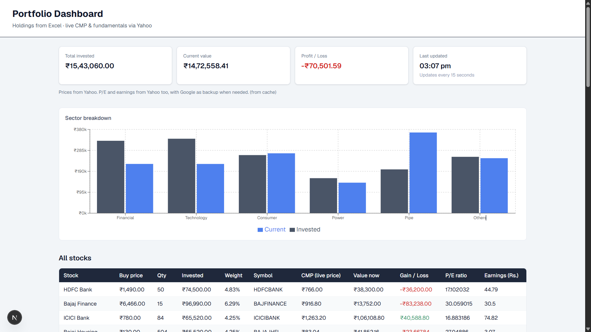

# Portfolio Dashboard - 8byte Full Stack Assignment (R1)

**Candidate:** Abishek M

Dear team,

Please find below my submission for the technical assignment. I have built a web application that displays the portfolio from the Excel file shared in the assignment email. The dashboard fetches live market data and refreshes automatically every 15 seconds.

If you are not familiar with stock market terms (CMP, P/E ratio, etc.), I have added a short glossary in **[FINANCE_TERMS.md](./FINANCE_TERMS.md)**.

## Screenshot



---

## Submission links

| Item | Link |
| ---- | ------ |
| Live deployment (Vercel) | `https://8byte-abishek.vercel.app` |
| Source code (GitHub) | `https://github.com/AbishekMahi/8byte-assignment` |
| Loom walkthrough | `https://www.loom.com/share/58f4f87ba02343a5a716d35643258e95` |
| Challenges document | **[CHALLENGES.md](./CHALLENGES.md)** (can be exported to PDF) |

---

## How to run the project locally

```bash
npm install
npm run dev
```

Open **`http://localhost:3000`** in your browser.

**Note:** The first load may take around 1-2 minutes (this is normal) because the server fetches prices for 26 stocks from Yahoo Finance. After that it gets faster - results are cached for 15 seconds.

To force a fresh fetch from Yahoo: **`http://localhost:3000/api/portfolio?refresh=true`**

**Recommended:** Node.js version **22 or above** for full P/E and earnings data (see CHALLENGES.md).

---

## Requirements covered

As per the assignment brief, I have implemented the following:

| Requirement | Implementation |
| ----------- | -------------- |
| Portfolio table with Excel columns | All columns shown; static data from `portfolio.json` |
| Live CMP | Fetched from Yahoo Finance on the server |
| P/E ratio and latest earnings | Yahoo Finance primary; Google Finance as fallback |
| Auto-refresh every 15 seconds | Client polls `/api/portfolio` every 15 sec |
| Gain/Loss highlighting | Green for profit, red for loss |
| Sector grouping | Separate section with sector totals |
| Sector chart | Bar chart (invested vs current value) |
| Tech stack | Next.js, React, TypeScript, Tailwind CSS, Node API route |

---

## Project structure (brief)

| Path | Purpose |
| ---- | ------- |
| `src/data/portfolio.json` | Holdings converted from the Excel file (26 stocks) |
| `src/app/api/portfolio/route.ts` | Backend API - entry point for all live data |
| `src/services/yahooBatchCore.ts` | Yahoo Finance — CMP, P/E, earnings (in-process) |
| `src/services/portfolioService.ts` | Builds table rows and sector summaries |
| `src/hooks/usePortfolio.ts` | Frontend data loading and 15-second refresh |
| `src/components/` | UI - table, chart, dashboard layout |

The browser does **not** call Yahoo or Google directly. All external requests are made from the server, which avoids CORS issues and keeps API logic in one place.

---

## Supporting documents

| Document | Description |
| -------- | ------------ |
| [ARCHITECTURE.md](./ARCHITECTURE.md) | How the application is structured and how data flows |
| [CHALLENGES.md](./CHALLENGES.md) | Technical challenges faced and how I resolved them |
| [FINANCE_TERMS.md](./FINANCE_TERMS.md) | Plain-language explanation of column names and finance terms |

---

## Loom video

In the Loom recording I walk through the codebase in a logical order: data source → API → Yahoo integration → calculations → UI → live demo. The suggested file order is listed in **ARCHITECTURE.md**.

Thank you for reviewing my submission. I am happy to clarify any part of the implementation in the next round.

Regards,  
Abishek M
